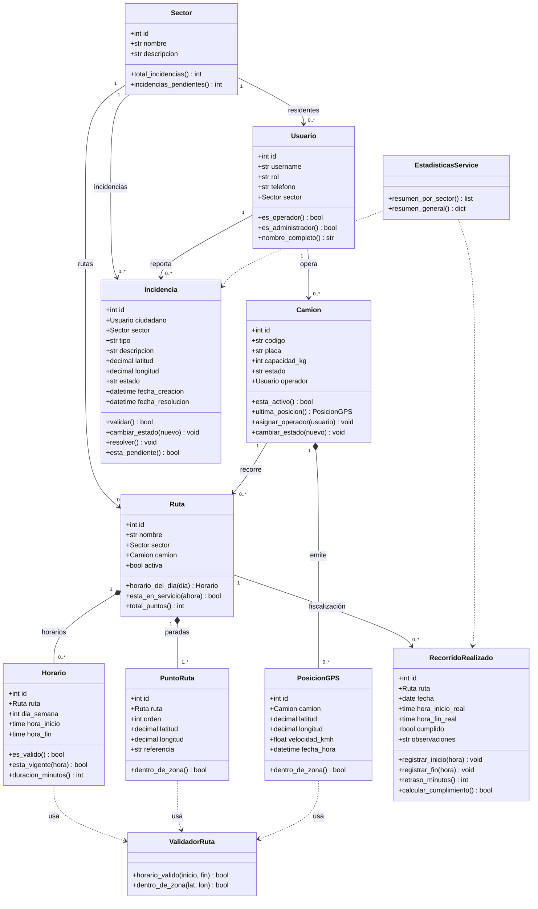

# Diagrama de clases UML – Sistema de Monitoreo de Residuos Sólidos (Amarilis)

```mermaid
classDiagram
    class Sector {
        +int id
        +str nombre
        +str descripcion
        +total_incidencias() int
        +incidencias_pendientes() int
    }
    class Usuario {
        +int id
        +str username
        +str rol
        +str telefono
        +Sector sector
        +es_operador() bool
        +es_administrador() bool
        +nombre_completo() str
    }
    class Camion {
        +int id
        +str codigo
        +str placa
        +int capacidad_kg
        +str estado
        +Usuario operador
        +esta_activo() bool
        +ultima_posicion() PosicionGPS
        +asignar_operador(usuario) void
        +cambiar_estado(nuevo) void
    }
    class Ruta {
        +int id
        +str nombre
        +Sector sector
        +Camion camion
        +bool activa
        +horario_del_dia(dia) Horario
        +esta_en_servicio(ahora) bool
        +total_puntos() int
    }
    class PuntoRuta {
        +int id
        +Ruta ruta
        +int orden
        +decimal latitud
        +decimal longitud
        +str referencia
        +dentro_de_zona() bool
    }
    class Horario {
        +int id
        +Ruta ruta
        +int dia_semana
        +time hora_inicio
        +time hora_fin
        +es_valido() bool
        +esta_vigente(hora) bool
        +duracion_minutos() int
    }
    class PosicionGPS {
        +int id
        +Camion camion
        +decimal latitud
        +decimal longitud
        +float velocidad_kmh
        +datetime fecha_hora
        +dentro_de_zona() bool
    }
    class Incidencia {
        +int id
        +Usuario ciudadano
        +Sector sector
        +str tipo
        +str descripcion
        +decimal latitud
        +decimal longitud
        +str estado
        +datetime fecha_creacion
        +datetime fecha_resolucion
        +validar() bool
        +cambiar_estado(nuevo) void
        +resolver() void
        +esta_pendiente() bool
    }
    class RecorridoRealizado {
        +int id
        +Ruta ruta
        +date fecha
        +time hora_inicio_real
        +time hora_fin_real
        +bool cumplido
        +str observaciones
        +registrar_inicio(hora) void
        +registrar_fin(hora) void
        +retraso_minutos() int
        +calcular_cumplimiento() bool
    }
    class ValidadorRuta {
        +horario_valido(inicio, fin) bool
        +dentro_de_zona(lat, lon) bool
    }
    class EstadisticasService {
        +resumen_por_sector() list
        +resumen_general() dict
    }

    Sector "1" --> "0..*" Usuario : residentes
    Sector "1" --> "0..*" Ruta : rutas
    Sector "1" --> "0..*" Incidencia : incidencias
    Usuario "1" --> "0..*" Incidencia : reporta
    Usuario "1" --> "0..*" Camion : opera
    Camion "1" --> "0..*" Ruta : recorre
    Camion "1" *-- "0..*" PosicionGPS : emite
    Ruta "1" *-- "1..*" PuntoRuta : paradas
    Ruta "1" *-- "0..*" Horario : horarios
    Ruta "1" --> "0..*" RecorridoRealizado : fiscalización
    Horario ..> ValidadorRuta : usa
    PuntoRuta ..> ValidadorRuta : usa
    PosicionGPS ..> ValidadorRuta : usa
    EstadisticasService ..> Incidencia
    EstadisticasService ..> RecorridoRealizado
```
